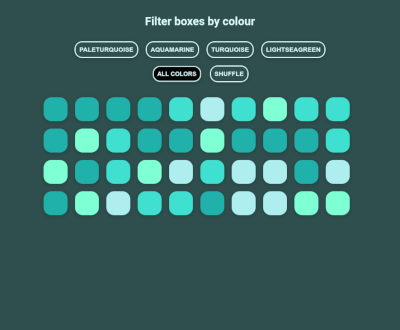

## React animation library testing

Exploring the different animation libraries available for React, how easy they are to use and what they can do.

There is a branch for each library

Libraries testing

- [react-pose](https://popmotion.io/pose/)
- [react-flip-toolkit](https://github.com/aholachek/react-flip-toolkit) with [animejs](https://github.com/juliangarnier/anime/)
- [react-spring](https://github.com/drcmda/react-spring)

[react-flip-toolkit/animeJS CodeSandbox](https://codesandbox.io/s/github/bushblade/react-animations-test/tree/flip/)

[react-pose CodeSandBox](https://codesandbox.io/s/github/bushblade/react-animations-test/tree/pose/)

[react-spring CodeSandbox](https://codesandbox.io/s/github/bushblade/react-animations-test/tree/spring/)

After a good play about with these libraries I have found since react-pose has been fixed in version 4.0.2 that pose is my preffered choice of animation library for react.

Pose for me has the best documentation of the three and has the most features. There is a pretty good (though a little quiet) community for the project on [Spectrum](https://spectrum.chat/popmotion). I issued a bug report early on in usage and found the developers very quick to respond and fix the issue.

Spring gets a little complex beyond simple useage and I found it can be pretty buggy, also unless I am missing it, there is no [FLIP](https://css-tricks.com/animating-layouts-with-the-flip-technique/) technique used. So its not great for list reordering/shuffling etc.

If you just need the FLIP powered reordering then react-flip-toolkit is great and simple to use, but needs addtional tooling for more. It does pair very well with animeJS though.
